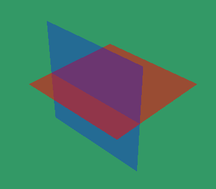

# magma::RenderEngine

The render engine is meant to be recent standards efficient and,
secondly, innovant. For the end-user, the renderer details are completly
hidden. This small documentation explains what's behind.

Currently only a deep-deferred renderer is implemented.

## Deep-deferred stage

In nowadays machines, a *deferred renderer* is an excellent tool,
as the lighting computation is the expensive operation.
It also provides useful render targets to make post-processing.

However, managing translucent meshes has always been a problem.
Fact is classic deferred renderers uses a forward renderer with sorting
for translucent objects, and thus it drops all the advantages
it had in such cases.



*That kind of things would be impossible with classic deferred renderer due to meshes sorting.*

In our **deep-deferred renderer**, a **GPU linked list** is constructed on the fly.
All the translucent fragments are added to the list, and, during the lighting
subpass, sorted. Thus, the sorting - when needed - occurs per fragment!

**Pros**:
- **Materials** (and not the meshes as usual) decides whether they should go to the translucent linked list or not ;
- **Per fragment** operations means that adding a small translucent texture on a mesh has almost no cost ; 
- **No need** to maintain a **forward renderer** ;
- **Post-processes** can use the linked list and be applied to translucent objects too ;
- **No more meshes sorting** at each frame for the CPU.

**Cons**:
- Expensive in memory (as if the classic deferred renderer was not enough) ;
- Surely harder to program.

## Present stage

This stage takes all the active cameras and their rendered images through the previous stage,
and combine them into a final target according to the registered views.

```C++
    magma::RenderEngine engine;

    // Here, we use the crater library to generate a window
    auto window = std::make_unique<crater::Window>(Extent2d{800, 600}, "title");
    auto& renderTarget = &engine.make<magma::WindowRenderTarget>(window.handle(), window.extent());

    // We decide to show the camera at a certain position in the render target
    auto& scene = &engine.make<magma::RenderScene>();
    auto& camera = &scene.make<magma::OrbitCamera>(window.extent());
    engine.addView(camera, renderTarget, Viewport{0, 0, 1, 1});
```
