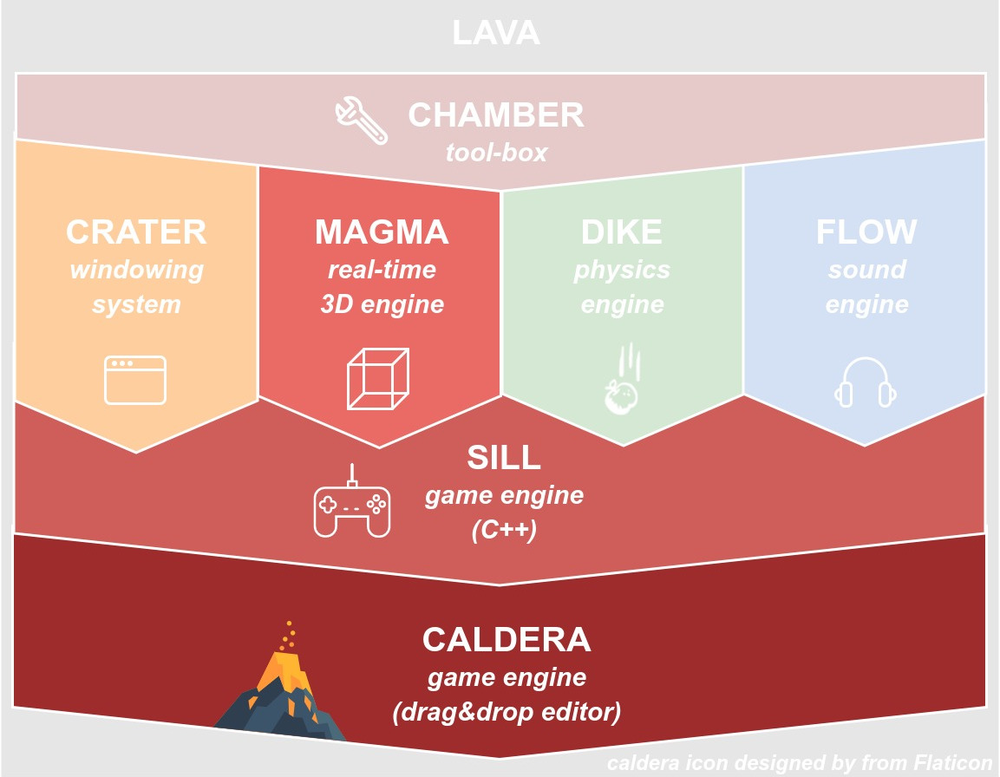

# lava

## Project's composition

The **lava** project is in fact a bundle of multiple projects.

The core principles of **lava** are:
- Be *up-to-date* with C++ standard (currently set to C++17) to make your code-life easier ;
- Keep your *APIs clean* (each project has a public interface with no more information than needed) ;
- *Decouple* as much as you can, keeping different concepts encapsulated.

## Contributing guide

**lava** uses *Premake* as build configuration system,
but some dependencies use:
- [cmake](https://cmake.org/) ;
- [python](https://www.python.org/).

Moreover, C++17 features are highly used, be sure to have a recent compiler (gcc >= 7).

- download [Premake v5](https://premake.github.io/download.html#v5) and install it from your platform ;
- run `./scripts/setup.sh` to install submodules and download dependencies ;
- run `./scripts/build.sh` to compile everything (with examples) ;
- find all executables in `build` folder.

__NOTE__ On linux, to use Wayland, either edit `.setup.json`
or run `./scripts/setup.sh --windowing-system=wayland`.

__NOTE__ To compile on release, one can use `make config=release`.

As a daily developper, one should use: `./scripts/run.sh <target-name> [debug]`.
This will enable Vulkan's validation layer, check dependencies,
compile only what's necessary, and run the associated executable.
If you don't know any target name, run the command without any.
Adding `debug` at the end of the command, will launch `gdb`.
Similarly, adding `profile` at the end of the command, will enable
profiling through `easy_profiler`, generating a `./build/profiling/xxx.prof` file.

### Compiling on Windows

In order to compile on *Windows*, you'll need to set-up a `bash` and `gcc` environment,
so that the commands specified in the above section work too.
Fact is, compiling the project with *Microsoft Visual Studio Compiler* has never been
tested, and I personally won't even try. But have no fear, all the projects **are**
cross-platform.

- download and install some [git bash](https://gitforwindows.org/) environment for windows ;
- download and install [MinGW](https://sourceforge.net/projects/mingw-w64/files/)
(find some `x86_64-posix-seh` in the readme with a recent `gcc`) ;
- be sure to have `cmake`, `bash` and `gcc` findable in your *PATH*.

You can then follow the contributing guide with `./scripts/setup.sh && ./scripts/build.sh`.

__NOTE__ During the set-up phase, on *Windows*, you might be prompt with *Vulkan SDK*
confirmation dialog. You have to accept.

### Generating documentation

- Have [doxygen](www.doxygen.org/) installed on your system ;
- `cd doc/technical && doxygen doxygen-config.xml` to generate technical documentation.

## Dependencies

Everything **lava** needs is downloaded via *Premake* to `external/`.

Current awesome dependencies are:
- [Bullet Physics](https://github.com/bulletphysics/bullet3)
- [easy_profiler](https://github.com/yse/easy_profiler) (optional)
- [Nlohman's JSON](https://github.com/nlohmann/json)
- [OpenGL Mathematics](http://glm.g-truc.net/)
- [OpenVR](https://github.com/ValveSoftware/openvr)
- [STB libraries](https://github.com/nothings/stb)
- [VulkanSDK](https://vulkan.lunarg.com/)

__NOTE__ The one guideline concerning dependencies is to not include within this repository any external source,
keeping the project light-weight and up-to-date. The one drawback is that compiling this repository in the future
could be impossible because of removed or changed projects. If so, a new repository should be created containing
the no-longer-available sources of concerned project.
