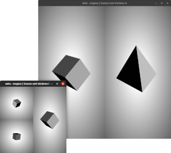

# lava

## Project's composition

The **lava** project is in fact a bundle of multiple projects.

The core principles of **lava** are:
- Be *up-to-date* with C++ standard (currently set to C++17) to make your code-life easier ;
- Keep your *APIs clean* (each project has a public interface with no more information than needed) ;
- *Decouple* as much as you can, keeping different concepts encapsulated.

## Examples

| Example  | Description | Result |
| ---- | ---- | ---- |
| **chamber**-watcher  | How to use the file and directory watcher, getting an event each time a file is created/deleted/modified. | `FileWatcher: watched directory has file "./data/tmp/watcher.tmp" modified.` |
| **crater**-events  | How to use the cross-platform `crater::Window` class while grabbing keyboard and mouse events. | `WsEventType::MouseMoved (x: 331, y: 67)` |
| **dike**-bouncy-sphere | How to use the physics engine, showing the result of a sphere under gravity bouncing on a plane. This output is the sphere vertical position printed in the terminal. |  |
| **flow**-play-musics | How to play multiple (streamed OGG) musics at once using the audio engine. | `Reading './assets/musics/buddy.ogg'.` |
| **flow**-play-sounds | How to play a (WAV) sound using the audio engine. | `Reading './assets/sounds/thunder.wav'.` |
| **flow**-spatialization-effect | How to use 3D spatialization of sounds, having a listener positioned in a 3D world. This is a demo of a fire-truck going around you. | `Reading './assets/sounds/fire-truck.wav'.` |
| **magma**-scenes-and-windows | How to use multiple windows and scenes with one instance of the render engine. |  |
| **magma**-shader-watcher | How to register a material to the render engine by specifiying a file. Then, this examples shows that one can edit the file and have on-the-fly updated results. |  |
| **magma**-shadows | How to use shadows with the render engine. The example shows that the cascaded shadow maps are updated per camera, so that they look good whatever happens. |  |
| **magma**-translucency | How to use [deep deferred renderer](./doc/implementation/magma-render-engine.md) to get correct translucency rendering with intersecting meshes. |  |
| **magma**-vr | How to use VR with the renderer via `magma::VrRenderTarget`. The renderer uses *OpenVR* to find the headset to draw to. | `Initializing VR.` |
| **sill**-matcap-material | How to use a matcap material with the game engine. |  |
| **sill**-mesh-makers | How to use makers to load *GLB* meshes or predefined shapes. |  |
| **sill**-physics-demo | How to use physics component. The examples expects the user to right-click to spawn bounceable spheres. |  |
| **sill**-rm-material | How to use shipped PBR (roughness-metallic) material. The examples shows a fully metallic sphere varying its roughness over time. |  |
| **sill**-sponza | How to load a big mesh. The examples shows how it is rendered with shadows and PBR materials. |  |
| **sill**-text | How to use the `sill::TextMeshComponent` to print text within a 3D scene. |  |
| **sill**-vr-sandbox | How to use the `sill::BehaviorComponent` to react to VR events. The examples is playground with interactive cubes. It has a independently-controllable companion window which shows the same scene than what is projected into the headset. |  |
| **sill**-vr-puzzle | A big project, as this is a full puzzle game made for VR. It is highly inspired by [The Witness](http://the-witness.net/) and made to be a complete experience. **Work in progress.** |  |

## Contributing guide

**lava** uses *Premake* as build configuration system,
but some dependencies use:
- *curl* ;
- [cmake](https://cmake.org/) ;
- [python](https://www.python.org/).

Moreover, C++17 features are highly used, be sure to have a recent compiler (gcc >= 7).

- download [Premake v5](https://premake.github.io/download.html#v5) and install it from your platform ;
- run `./scripts/setup.sh` to install submodules and download dependencies ;
- run `./scripts/build.sh` to compile everything (with examples) ;
- find all executables in `build` folder.

__NOTE__ On linux, to use Wayland, either edit `.setup.json`
or run `./scripts/setup.sh --windowing-system=wayland`.

__NOTE__ To compile on release, one can use `make config=release`.

As a daily developper, one should use: `./scripts/run.sh <target-name> [debug]`.
This will enable Vulkan's validation layer, check dependencies,
compile only what's necessary, and run the associated executable.
If you don't know any target name, run the command without any.
Adding `debug` at the end of the command, will launch `gdb`.

### Compiling on Windows

In order to compile on *Windows*, you'll need to set-up a `bash` and `gcc` environment,
so that the commands specified in the above section work too.
Fact is, compiling the project with *Microsoft Visual Studio Compiler* has never been
tested, and I personally won't even try. But have no fear, all the projects **are**
cross-platform.

- download and install some [git bash](https://gitforwindows.org/) environment for windows ;
- download and install [MinGW](https://sourceforge.net/projects/mingw-w64/files/)
(find some `x86_64-posix-seh` in the readme with a recent `gcc`) ;
- be sure to have `cmake`, `bash` and `gcc` findable in your *PATH*.

You can then follow the contributing guide with `./scripts/setup.sh && ./scripts/build.sh`.

### Generating documentation

- Have [doxygen](www.doxygen.org/) installed on your system ;
- `cd doc/technical && doxygen doxygen-config.xml` to generate technical documentation.

## Dependencies

Everything **lava** needs is downloaded via *Premake* to `external/`.

Current awesome dependencies are:
- [Bullet Physics](https://github.com/bulletphysics/bullet3)
- [MikkTSpace](https://github.com/tcoppex/ext-mikktspace)
- [Nlohman's JSON](https://github.com/nlohmann/json)
- [OpenGL Mathematics](http://glm.g-truc.net/)
- [OpenVR](https://github.com/ValveSoftware/openvr)
- [Shaderc](https://github.com/google/shaderc)
- [STB libraries](https://github.com/nothings/stb)
- Vulkan [headers](https://github.com/KhronosGroup/Vulkan-Headers) and [loader](https://github.com/KhronosGroup/Vulkan-Loader)

__NOTE__ The one guideline concerning dependencies is to not include within this repository any external source,
keeping the project light-weight and up-to-date. The one drawback is that compiling this repository in the future
could be impossible because of removed or changed projects. If so, a new repository should be created containing
the no-longer-available sources of concerned project.
